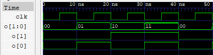
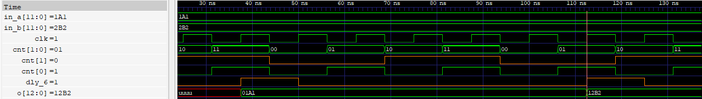
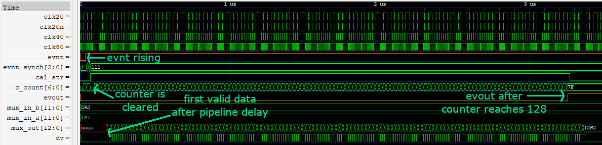
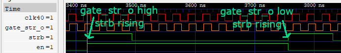
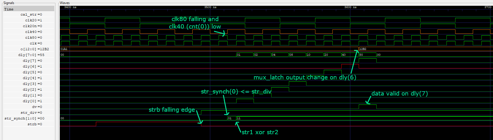
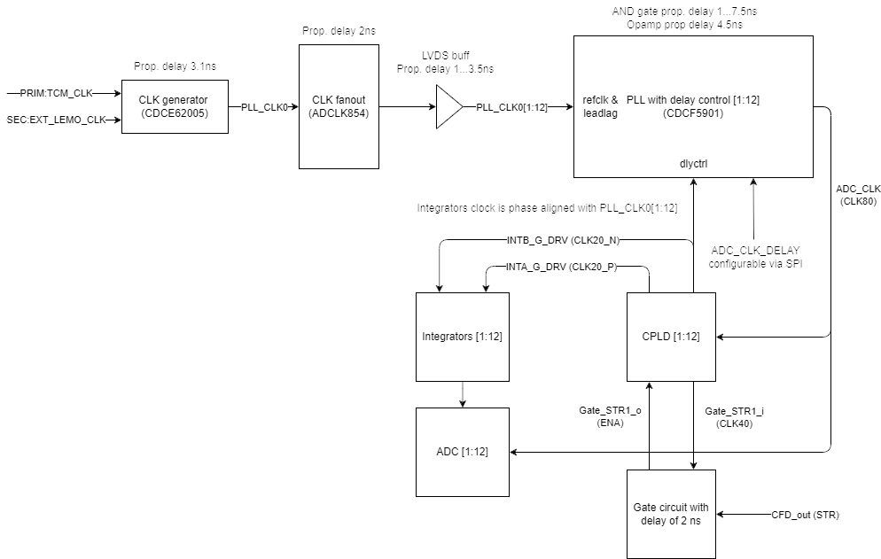
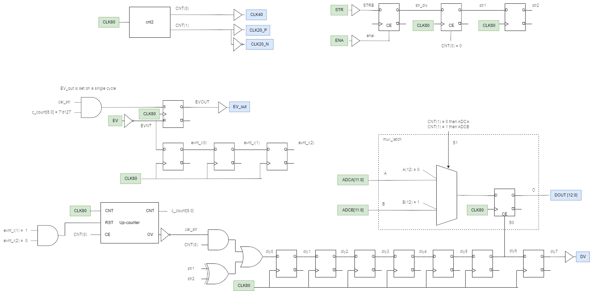
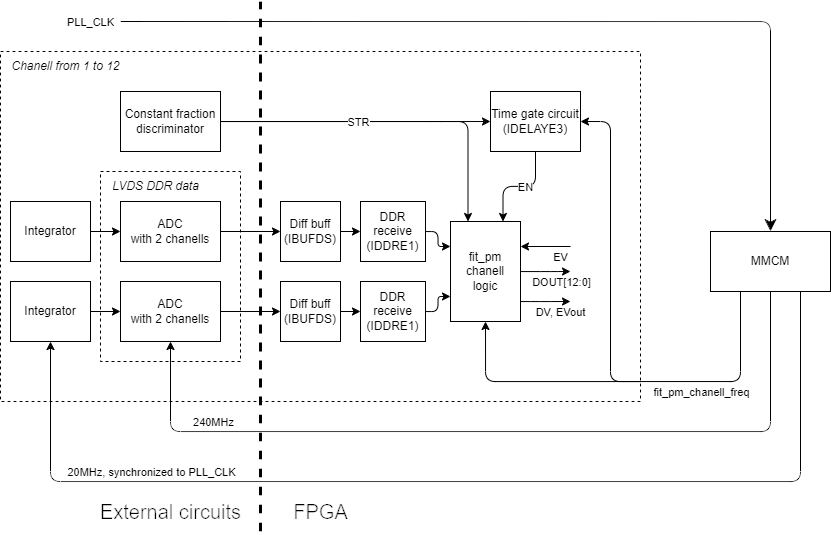

# FIT_PM_GW_CPLD

## Signals in code vs on schematics

| Code | Schematic | Comment |
| - | - | - |
| ENA - enable | Gate_STR1_o | input from external gate circuit, latches when CFD rising edge comes when CLK40 (delayed by 2 ns) is high |
| EV - event | EV_in | input signal to trigger test measurement, in chain of PM modules one EV_out output is connecte to another's module EV input |
| STR - strobe | CFD_OUT | input signal from external CFD (Constant fraction discriminator) |
| DV - data valid | STR | output to indicate that data on DOUT are valid |
| EV_out - event out | EV_out | output connected to next module EV input |
| DOUT - data out | DI0…12 | output data |
| ADC0 | ADCA_D0…11 | input data from first ADC connected to integrator |
| ADC1 | ADCB_D0…11 | input data from second ADC connected to integrator |
| CLK80 | ADC_CLK | clock 80MHz for CPLD |
| CLK40 | Gate_STR1_i | clock for gate stobe circuit |
| CLK20_P | INTA_G_DRV | integrator for even bunches |
| CLK20_N | INTB_G_DRV | integrator for odd bunches |

## `cnt2` module description
Output signals are clock-type signals with frequency(clk)/2 and frequency(clk)/4 where clk has 80 MHz. Which are:
* 40 MHz signal for gate circuit for strobe signal which comes out from CFD (Constant fraction discriminator)
* 20 MHz signal as a trigger for integrators
\

## `mux_latch` module description
Output value is switched between two input values which are outputs of two integrators. `dly_6` signal is a strobe singal delayed by 6 clk cycles due to ADC pipeline delay. `cnt(1)` is a 20 MHz trigger signal for integrators.
`in_a` is propagated to output in case strobe signal comes when `cnt(1)` is low and `in_b` when high.

## `amplcpld` module description
There are two ways in which the module can be activated: using event or using strobe signal.\
`evnt` is signal generated form previous module in chain as `evout`. When event is triggered 7-bit counter is cleared and counts up to 127. The counter is incremented with every cycle of 40 MHz clock. Output data comes alternately from both integrators, each measurement is marked with `dv` data valid signal.
\
`en` signal comes form external D flip-flop which data input is `gate_str_o` and it's clock is `strb` which comes out from CFD (Constant fraction discriminator). `gate_str_o` is `clk40` delayed by 2 ns.
\

## FIT PM clocks architecture

## FIT PM cpld architecture

## FIT PM fpga architecture (NEW VERSION)
